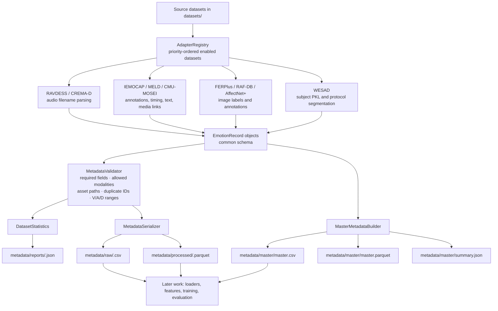

# Capstone project context

## Purpose and current stage

This repository is building the **data foundation for a multimodal emotion-recognition capstone**. Its current deliverable is a validated, unified metadata layer over nine heterogeneous emotion datasets. It does **not** yet contain model training, feature extraction, data loaders for training, evaluation experiments, an API, or a user interface.

The project normalizes dataset-specific annotations into one record format, preserves paths to the original assets, and writes per-dataset and master metadata artifacts. This lets later stages select samples by modality, emotion, split, speaker, timing, sentiment, or source dataset without re-parsing each original corpus.

## What has been completed

- A reusable `EmotionRecord` schema and path conventions were created.
- A registry-driven preprocessing framework was implemented, with a base adapter, serializer, validator, reporting, logging, and master-metadata builder.
- Adapters were implemented and enabled for all nine datasets:
  RAVDESS, CREMA-D, IEMOCAP, MELD, CMU-MOSEI, FERPlus, RAF-DB, AffectNet+, and WESAD.
- Dataset-specific labels are mapped to a common emotion vocabulary where applicable.
- Per-dataset CSV, Parquet, and JSON statistics are generated under `metadata/`.
- FERPlus images are extracted from its source Parquet on first preprocessing run so metadata can point to real PNG files.
- IEMOCAP dimensional labels (valence/arousal/dominance), MELD timing/text/video metadata, CMU-MOSEI text/sentiment metadata, and WESAD protocol/sensor metadata are preserved.

Recent uncommitted work expands the framework to IEMOCAP, MELD, CMU-MOSEI, and WESAD; it also strengthens path, duplicate-ID, modality, and dimensional-label validation. Existing changes in the worktree were preserved by this document.

## Repository map

| Location | Role |
| --- | --- |
| `datasets/` | Original datasets, annotation files, archives, and extracted assets. |
| `src/common/models.py` | Defines the `EmotionRecord` dataclass. |
| `src/common/paths.py` | Central locations for datasets and generated metadata. |
| `src/common/constants.py` | Allowed modalities and known datasets. |
| `src/preprocessing/registry.py` | Dataset-to-adapter registry, enabled flags, modalities, and priority order. |
| `src/preprocessing/adapters/` | One source-specific scanner per dataset. |
| `src/preprocessing/emotion_mapping.py` | Source-label to common-label mappings. |
| `src/preprocessing/core/` | Base adapter, pipeline orchestration, validation, serialization, and master builder. |
| `src/preprocessing/generate_metadata.py` | CLI entry point for the full preprocessing run. |
| `src/analysis/statistics.py` | Per-dataset counts by emotion, split, and modality. |
| `metadata/raw/` | Per-dataset CSV metadata. |
| `metadata/processed/` | Per-dataset Parquet metadata. |
| `metadata/reports/` | Per-dataset JSON reports. |
| `metadata/master/` | Combined CSV/Parquet metadata and global summary. |

## Current end-to-end flow



### How a full run works

Run from the repository root:

```bash
python -m src.preprocessing.generate_metadata
```

`generate_metadata.py` iterates through `AdapterRegistry.enabled_datasets()` in this order: RAVDESS, CREMA-D, IEMOCAP, MELD, CMU-MOSEI, FERPlus, RAF-DB, AffectNet+, WESAD. For every dataset, `MetadataPipeline.run()`:

1. scans source-specific files into `EmotionRecord` instances;
2. validates records before writing;
3. calculates per-dataset distributions;
4. overwrites that dataset's CSV, Parquet, and report; and
5. adds the valid records to the in-memory master builder.

After all adapters succeed, the master builder concatenates records, normalizes DataFrame column types, and writes the combined CSV, Parquet, and summary JSON. A failure stops the full run and prevents a fresh master build; files already written by earlier datasets remain on disk.

## Unified record contract

Each row includes the following main fields:

| Area | Fields |
| --- | --- |
| Identity | `sample_id`, `dataset`, `split` |
| Labels | `raw_emotion`, normalized `emotion`, `valence`, `arousal`, `dominance`, `sentiment_score` |
| Modalities | `modalities`, `audio_path`, `video_path`, `image_path`, `text`, `physiology_path` |
| Context | `speaker`, `gender`, `duration`, `segment_start`, `segment_end` |
| Dataset-specific detail | `extras` (JSON serialized in CSV/Parquet) |

Asset paths are stored relative to `datasets/`, which keeps metadata portable within this repository. `modalities` is serialized as a comma-separated string. The validated modality set is `audio`, `video`, `image`, `text`, and `physiology`.

## Dataset coverage

| Dataset | Current record unit and usable modalities | Important preserved information |
| --- | --- | --- |
| RAVDESS | One WAV file; audio | speech/song split, actor, inferred gender, intensity, statement, repetition |
| CREMA-D | One WAV file; audio | actor, sentence, emotion code, intensity level |
| IEMOCAP | One annotated utterance; audio when WAV exists | session split, V/A/D scores, timing, dialogue, speaker/gender |
| MELD | One utterance; text plus video when MP4 exists | official train/dev/test split, dialogue/utterance IDs, speaker, sentiment, season/episode, timing |
| CMU-MOSEI | One labelled clip; currently text | official split, categorical annotation, continuous sentiment, video/clip IDs; feature-file reference to `Processed/aligned_50.pkl` |
| FERPlus | One extracted PNG; image | source label; currently all records are marked `train` |
| RAF-DB | One image; image | source train/test split and numeric label |
| AffectNet+ | One face image; image | train/validation split, valence/arousal, gender and other annotation metadata |
| WESAD | One subject PKL; physiology | sensor names/shapes/rates, device names, label counts, and protocol segments in `extras` |

### Label normalization

The common labels include `neutral`, `happy`, `sad`, `angry`, `fear`, `disgust`, `surprise`, `contempt`, `excited`, `frustrated`, `stress`, `calm`, and `other`. Source-specific states are intentionally retained where the source does not map cleanly—for example AffectNet+ `none`, `uncertain`, and `non_face`; WESAD protocol states; and `unknown` for unmapped values. Raw labels are always retained alongside normalized labels.

## Generated-data snapshot

The saved **per-dataset reports** currently cover all nine adapters. Their reported record counts are:

| Dataset | Records | Current reported modalities |
| --- | ---: | --- |
| AffectNet+ | 420,299 | image |
| FERPlus | 35,481 | image |
| RAF-DB | 15,339 | image |
| MELD | 13,708 | text; video for 13,707 records |
| IEMOCAP | 10,039 | audio |
| CREMA-D | 7,442 | audio |
| RAVDESS | 2,452 | audio |
| CMU-MOSEI | 22,856 | text |
| WESAD | 15 | physiology |
| **Total reported across adapters** | **527,631** | — |

Important: `metadata/master/master.csv`, `master.parquet`, and `summary.json` were built before the MELD and CMU-MOSEI reports were generated. They currently contain **491,067 records from seven datasets** and are therefore stale relative to the enabled registry and per-dataset reports. The next successful full command above should rebuild the master to include all nine datasets (expected count based on current reports: 527,631), assuming the source data remains unchanged.

## Validation and operational details

- Validation rejects empty scans, missing IDs/dataset/modality lists, unsupported modalities, missing files for declared audio/video/image/physiology modalities, and duplicate `(dataset, sample_id)` pairs.
- It checks IEMOCAP V/A/D in its observed source ranges; other dimensional values must be in `[-1, 1]` when present.
- Text needs no asset path. CMU-MOSEI currently declares only `text`, because its audio/vision are held in a processed PKL for a future feature-loading layer rather than as per-sample files.
- MELD may be text-only when a corresponding video file is unavailable; this is valid under the present validator.
- WESAD's record-level `emotion` is empty because each subject contains a multi-state protocol; segment labels live in `extras.protocol`.
- The pipeline relies on Python packages visible from imports: `pandas`, `numpy`, Pillow (`PIL`), and a Parquet engine such as `pyarrow` or `fastparquet`. A `venv/` exists, but no dependency lockfile or requirements file is currently tracked.

## Known gaps / next logical work

1. Run and verify a complete nine-dataset build to refresh the master artifacts.
2. Decide a training label policy: for example, whether to filter AffectNet+ `none`/`uncertain`/`non_face`, how to handle WESAD protocol segments, and whether `calm`, `excited`, and `frustrated` become separate classes or are remapped.
3. Implement modality-specific loaders and feature extraction (audio, video, image, text, and physiological time series).
4. Define cross-dataset split and leakage rules—especially speaker/subject-aware splits—and build training-ready manifests.
5. Add automated tests, reproducible dependency configuration, run documentation, and data/version provenance.
6. Train baseline unimodal models, then a multimodal fusion model, and add evaluation/experiment tracking.

## Quick handoff notes

- Start at `src/preprocessing/generate_metadata.py` to understand or rerun the pipeline.
- Add a new dataset by writing a `BaseAdapter.scan()` implementation, registering it in `AdapterRegistry`, adding mappings as appropriate, then running the generator.
- Treat files under `metadata/` as generated artifacts; regenerate them after changing adapters, mappings, validation, or the source dataset contents.
- Do not assume every registry-declared modality exists on every row: modality availability is record-level and represented by both `modalities` and the corresponding path/text field.
